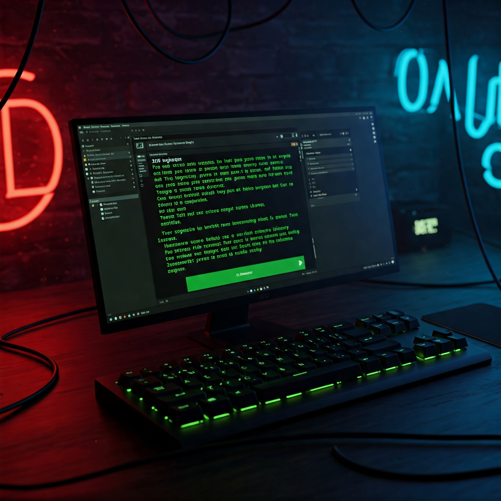

# Advanced Keylogger & System Monitor



## Overview
Hi guys, this is my first cybersecurity project! (theoretically)
This project is an advanced keylogger and system monitoring tool that captures keystrokes, clipboard data, microphone audio, screenshots, and system information. It is designed to run continuously, logging data and detecting changes in real-time.

## Features
### 1. **Keylogger**
- Captures all keystrokes typed by the user.
- Formats special keys (e.g., `[Enter]`, `[Space]`, etc.).

### 2. **Clipboard Monitoring**
- Detects changes in clipboard contents.
- Logs new clipboard data only when it changes.
- Stores clipboard history in a log file.

### 3. **Microphone Recording**
- Records audio when the volume exceeds a predefined threshold.
- Stops recording when silence is detected for a set duration.
- Saves audio recordings as `.wav` files.

### 4. **Screenshot Capture**
- Takes a screenshot of all connected screens every 30 minutes.

### 5. **System Information Collection**
- Retrieves system details, including OS, hostname, IP address, MAC address, and hardware specifications.
- Lists running processes, excluding common system processes.
- Updates every 1 hour.

## Libraries Used
- **pynput** (Keyboard event listening)
- **pyperclip** (Clipboard monitoring)
- **sounddevice** (Audio recording)
- **Pillow** (Screenshot capture)
- **wmi** (System information retrieval on Windows)
- **socket & uuid** (Network and device identification)
- **threading** (Running multiple monitoring tasks in parallel)
- **time & datetime** (Task scheduling and timestamps)

## Setup & Execution
1. Install dependencies:
   ```sh
   pip install -r requirements.txt
   ```
2. Run the script as administrator (if necessary for permissions):
   ```sh
   python keylogger.py
   ```

## Notes
- The script continuously runs in the background.
- The log files and captured data are stored in a specified directory.
- Ensure you have the necessary permissions to access system components.

## Disclaimer
This tool is intended for educational and ethical research purposes only. 
